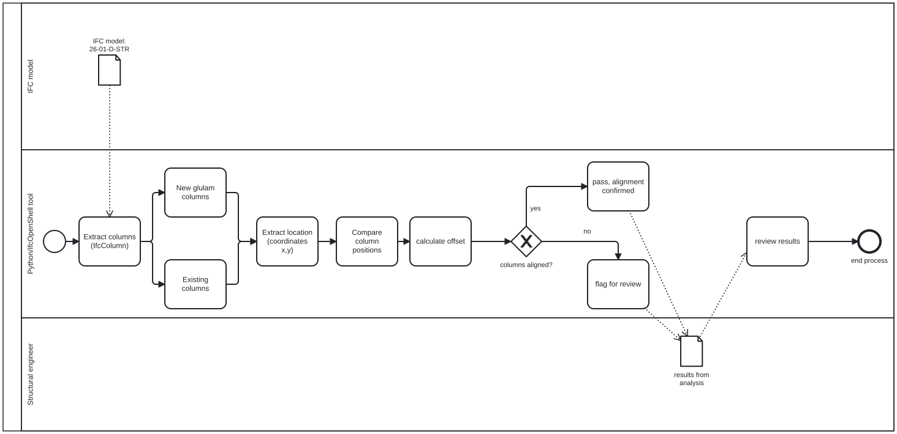

## A2a – Group 22

**Python confidence:** 2/4

**Focus area:** STR – Structures

**Role:** Analyst

## A2b – Claim

### Claim

New glulam columns are positioned directly above existing load-bearing
elements wherever possible, providing direct load paths. We will use the IFC model to investigate whether the spatial arrangement of the new glulam columns supports this claim.

### Justification of claim

This claim was selected because the alignment of the new and existing structural elements is an important part of the proposed structural concept. The report states that the new floor transfers loads through the CLT slabs, glulam beams and glulam columns into the existing concrete structure. Checking the spatial alignment between the new and existing columns is therefore a way of testing whether the BIM model reflects the stated structural concept.

### Source

Structural Report 2601, Section 2.4, p. 4 and Section 8.1, p. 20.

## A2c – BPMN Diagram

[Open BPMN file](IMG/diagram.bpmn)

## A2d - Scope the use case

The tool will focus on the geometric relationship between new glulam
columns and existing load-bearing columns.

The tool will:

1. Identify existing load-bearing columns.
2. Identify new glulam columns.
3. Extract their X/Y positions.
4. Compare the positions of the columns.
5. Calculate the horizontal offset.
6. Flag columns that are not sufficiently aligned.

The tool will not perform structural capacity calculations or determine
whether a deviation is structurally acceptable. These decisions remain
with the structural engineer.

[Open BPMN file](IMG/diagram%20edited.bpmn)

## A2e – Tool Idea

The proposed tool will be a Python-based IFC checking tool using
IfcOpenShell.

The tool will analyse the spatial relationship between existing
load-bearing columns and new glulam columns.

The output will identify whether each new column is aligned with an
existing load-bearing element and flag cases that require further
investigation.

### Business value

The tool can reduce manual checking of column positions and help
identify potential load-path issues earlier in the design process.

### Societal value

The tool can support more reliable structural coordination and reduce
the risk of errors in the digital structural model.
